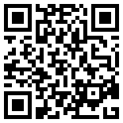

# BRIXEL Physical Computing — v0.1.0

micro:bit에서 디스플레이, 센서, 모터, 출력 장치와 통신 장치를 제어하는 BRIXEL 전체 입출력 MakeCode 확장입니다. 기존 확장의 **435개 블록, 10개 카테고리, 35개 언어 번역**을 포함합니다. micro:bit V2를 기준으로 게시·컴파일을 확인합니다.

## 피지컬컴퓨팅 바로 시작하기

**[피지컬컴퓨팅 프로젝트 열기](https://makecode.microbit.org/_Fo84JDihLTPm)**

아래 QR코드를 스캔하거나 위 링크를 누른 뒤 **코드 편집**을 선택하세요. BRIXEL 피지컬컴퓨팅 확장 v0.1.0이 이미 들어 있으며, `radio`를 제외한 시작 프로젝트이므로 확장을 다시 추가하거나 radio 충돌 안내를 처리할 필요가 없습니다.

[](https://makecode.microbit.org/_Fo84JDihLTPm)

## 기존 프로젝트에 확장 추가하기

1. [MakeCode micro:bit](https://makecode.microbit.org/)에서 새 프로젝트를 만듭니다.
2. **확장**을 열고 아래 주소를 검색창에 붙여 넣습니다.
3. **brixel-physical-computing**을 선택합니다. 내장 BLE를 포함하므로 `radio`와의 충돌 안내가 나오면 **radio를 제거하고 확장 추가**를 선택합니다.
4. 도구 상자에서 `디스플레이`, `센서`, `모터장치`, `블루투스` 등 10개 카테고리를 확인합니다. 언어 설정이 영어이면 번호가 붙은 영어 카테고리로 표시됩니다.

```text
https://github.com/brixel-editor/pxt-brixel-physical-computing
```

이 주소로 설치하는 공개 확장입니다. MakeCode 기본 검색 목록에 등록되는 공식 승인 여부와는 별개입니다. 기존 프로젝트는 **JavaScript → 탐색기 → brixel-physical-computing 옆 버전/업데이트 버튼**으로 갱신합니다.

## 포함한 카테고리

| 카테고리 | 주요 장치·기능 | 블록 수 |
|---|---|---:|
| 01. Displays | LCD, TM1637 숫자 표시, NeoPixel | 29 |
| 02. Adv Displays | SSD1306/SH1106 OLED, HT16K33, MAX7219, 74HC595, TFT | 60 |
| 03. Sensors | 온습도·수온·초음파·NTC·무게·미세먼지·가스·pH·TDS·탁도·전압·지문 등 | 96 |
| 04. Adv Sensors | RTC, 기압, 가속도·자이로, 색상·제스처, 심박, I2C 무게 등 | 92 |
| 05. Actuators | 서보, GeekServo, DC 모터, 스테퍼와 모터 드라이버 | 48 |
| 06. Output Device | 부저, 오디오 모듈, EEPROM | 35 |
| 07. Communications | IR, RFID/NFC, nRF24L01, LoRa, GPS 등 | 39 |
| 08. WiFi | ESP AT 모듈 연결, WebSocket 송수신 | 11 |
| 09. USB Serial | USB/핀 시리얼 송수신, 수신 이벤트·문자열 분리 | 14 |
| 10. Bluetooth | 내장 BLE UART 송수신, 연결·수신 이벤트 | 11 |
| **합계** | 드롭다운 선택지는 별도이며 435개에 중복 포함하지 않음 | **435** |

## 첫 실행 예제: 서보 각도

서보 신호를 실제 연결한 P핀으로 바꾸고, 서보 전원 정격에 맞는 외부 전원과 공통 GND를 사용합니다. 새 프로젝트의 JavaScript에 다음 코드를 넣으면 A 버튼은 0°, B 버튼은 90°로 이동합니다. 서보가 허용하는 각도와 기구 간섭을 확인하세요.

```typescript
input.onButtonPressed(Button.A, function () {
    Actuators05.servoSetAngle(AnalogPin.P1, 0)
})
input.onButtonPressed(Button.B, function () {
    Actuators05.servoSetAngle(AnalogPin.P1, 90)
})
```

## 사용 조건과 검증 범위

- 실드 소켓 번호 대신 실제 micro:bit **P핀 번호**를 설정합니다. 모듈의 신호 전압, 전원 용량, I2C 주소 중복과 공유 핀을 확인합니다. 5V 신호를 micro:bit 핀에 직접 입력하지 않습니다.
- 센서 UART와 USB는 기존 확장의 `USBSerial` 중재 코드로 핀을 전환합니다. 여러 UART 모듈의 연속 데이터를 동시에 수집하는 구조가 아니며 소유권을 잃은 동안 수신이 누락될 수 있습니다. WiFi는 micro:bit 자체 무선 인터넷이 아니라 별도 ESP AT 모듈을 사용합니다.
- 이번 게시 작업은 기존 전체 블록을 설치 가능한 패키지로 정리한 것입니다. 블록·번역 정합성, 분할 전후 소스/번역 보존과 V2 컴파일을 검사합니다. **모든 실물 장치의 동작이나 측정 정확도를 검증한 것은 아닙니다.**
- 원본에 남아 있는 제약도 유지됩니다. 예를 들어 APDS9960의 서로 다른 FIFO 읽기 블록을 동시에 사용하면 데이터가 분산될 수 있고, MAX30102는 분리 후 캐시 상태를 실제 손가락 감지로 해석하지 않도록 확인이 필요합니다. 모듈별 연결·응답·단위는 실물로 대조하세요.
- `test.ts`는 컴파일 검사 전용입니다. 서로 핀·주소를 공유하는 장치를 함께 호출하므로 생성된 검사 HEX를 수업용 프로그램으로 실행하지 않습니다. 필요한 장치만 넣은 별도 프로그램을 사용하세요.

## 과학실험 확장과의 관계

전체 장치 제어용은 **이 저장소**, 센서 데이터 수집과 바우어버드 전송 중심의 단순 블록은 [BRIXEL Science Lab](https://github.com/brixel-editor/pxt-brixel-science-lab)입니다. 두 확장의 API와 통신·보정 구현은 다릅니다. Science Lab의 센서별 보정 안내를 이 확장의 다른 API에 그대로 적용하지 않습니다.

## 소스와 라이선스

기존 `brixel-final-dev_20260725`의 작업 파일을 기준으로 게시했습니다. [SOURCES.md](SOURCES.md)에 포장 과정과 검증 방법을 설명합니다. 원본 폴더·기존 저장소는 보존하며 새 저장소는 `brixel-editor/pxt-brixel-physical-computing`입니다.

[MIT License](LICENSE), Copyright (c) 2026 BRIXEL.

## Supported targets

* for PXT/microbit
